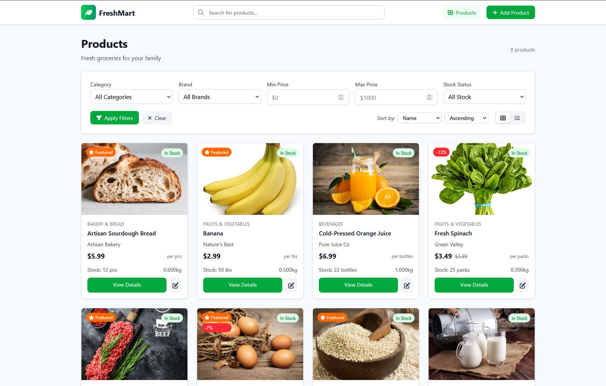

<h1 align="center">FreshMart</h1>

A modern, responsive feature-rich grocery market management application built with Laravel using MVC architecture.


<p align="center">
    
</p>

## ✨ Features

- ✅ **Product Management** - Create, read, update, and delete grocery products
- ✅ **Advanced Search** - Real-time search across product names, descriptions, brands, and tags
- ✅ **Smart Filtering** - Filter by category, brand, price range, and stock status
- ✅ **Multiple Views** - Switch between grid and list layouts
- ✅**Responsive Design** - Works perfectly on desktop, tablet, and mobile devices
- ✅ **Stock Management** - Track inventory levels with low stock alerts
- ✅ **Image Upload** - Support for product images with storage management
- ✅ **Modern UI** - Clean, professional interface using Tailwind CSS

## 🛠️ Tech Stack

- **Backend:** Laravel 
- **Frontend:** Blade Templates + Tailwind CSS + Alpine.js
- **Database:** MySQL
- **Icons:** Font Awesome 6
- **Build Tool:** Vite
- **Image Storage:** Laravel Storage with Symbolic Links

## 🚀 Quick Setup

### Prerequisites
- PHP 8.2+
- Composer
- Node.js & NPM
- MySQL

### Installation

1. **Clone & Install Dependencies**
   ```bash
   git clone <your-repo-url> freshmart
   cd freshmart
   composer install
   npm install
   ```

2. **Environment Setup**
   ```bash
   cp .env.example .env
   php artisan key:generate
   ```

3. **Database Configuration**
   
   Update your `.env` file:
   ```env
   DB_CONNECTION=mysql
   DB_HOST=127.0.0.1
   DB_PORT=3306
   DB_DATABASE=freshmart
   DB_USERNAME=your_username
   DB_PASSWORD=your_password
   ```

4. **Database Setup**
   ```bash
   php artisan migrate
   php artisan db:seed --class=ProductSeeder
   php artisan storage:link
   ```

5. **Build Frontend Assets**
   ```bash
   npm run build
   ```

6. **Start Development Server**
   ```bash
   php artisan serve
   ```

   Visit: `http://localhost:8000`

---

### Documentation

- [Laravel Documentation](https://laravel.com/docs)
- [Tailwind CSS Documentation](https://tailwindcss.com/docs)
- [Alpine.js Documentation](https://alpinejs.dev/)
